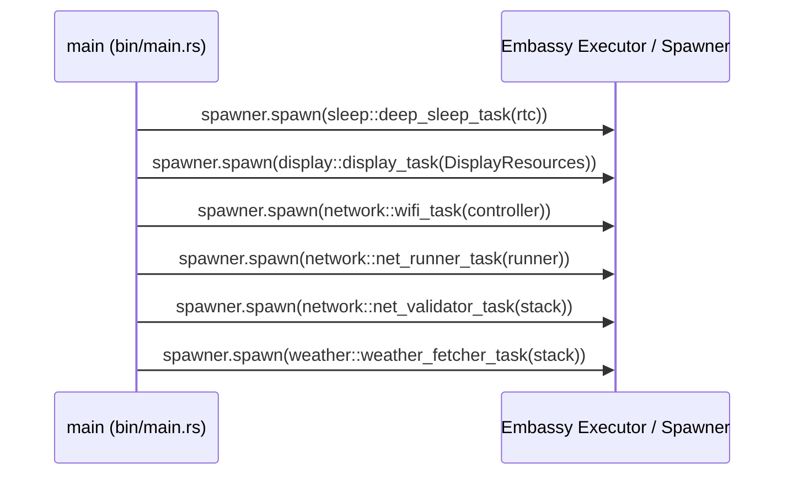
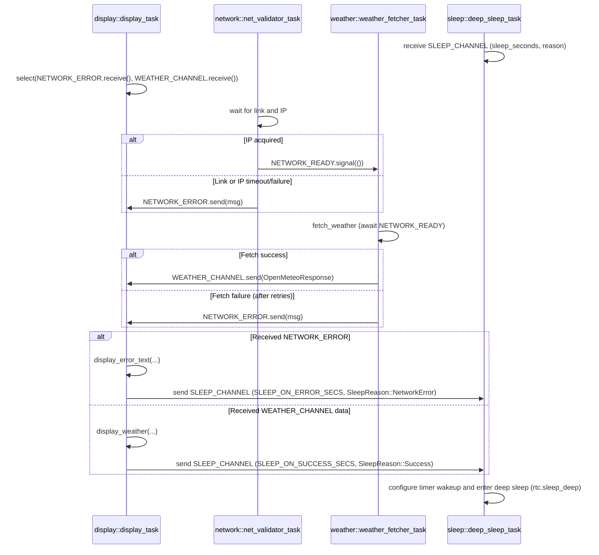

# MagTag Weather Station

A `no_std` Rust firmware for the 2025 revision of the [Adafruit MagTag](https://www.adafruit.com/product/4800) with the SSD1680 controller. It displays weather information on the e-paper display. Built with the `esp-hal` ecosystem for ESP32-S2, this project demonstrates async/await patterns with Embassy, network connectivity with `esp-radio`, and e-paper graphics rendering.

## Features

- **E-Paper Display**: Drives the SSD1680 2.9" grayscale e-paper display (296x128 pixels) over SPI
- **WiFi Connectivity**: Connects to WiFi using `esp-radio` and `embassy-net` with async networking
- **Weather Data**: Fetches weather forecasts from the [Open-Meteo API](https://open-meteo.com/)
- **Graphical UI**: Renders weather data with icons, text, and formatting using `embedded-graphics` and `embedded-text`
- **Low Power**: Enters deep sleep between updates to conserve battery (24-hour update cycle by default)
- **Error Handling**: Displays error messages on the e-paper screen when issues occur
- **No Standard Library**: Runs entirely in `no_std` environment with custom allocator

## Credits

This project was inspired by Adafruit's [MagTag Weather Example](https://learn.adafruit.com/magtag-weather) [(github)](https://github.com/adafruit/Adafruit_Learning_System_Guides/blob/main/MagTag/MagTag_Weather/openmeteo/code.py) and demonstrates how to build similar functionality in pure Rust with `no_std`. The background and icon asserts are modified from the originals.

## Hardware Requirements

- [Adafruit MagTag](https://www.adafruit.com/product/4800) - 2025 Edition with SSD1680 (ESP32-S2 based e-paper display) 
- USB cable for programming and power
- Optional: USB-to-serial adapter for debugging (see Serial Logging section)

## Software Prerequisites

1. **Rust Toolchain**: Install Rust with the Espressif Xtensa toolchain
   - Follow the [esp-rs Getting Started guide](https://docs.esp-rs.org/book/installation/index.html)
   - Requires the `xtensa-esp32s2-none-elf` target

2. **Flashing Tool**: Install `espflash`
   ```bash
   cargo install espflash
   ```

3. **Environment Variables**: Set WiFi credentials as environment variables
   ```bash
   export SSID="YourNetworkName"
   export PASSWORD="YourNetworkPassword"
   ```

## Configuration

Edit [src/config.rs](src/config.rs) to customize:

- `OPENMETEO_LATITUDE` / `OPENMETEO_LONGITUDE` — Your location coordinates
- `OPENMETEO_TIMEZONE` — Your timezone (e.g., "America/Denver")
- `TEMPERATURE_UNIT` — "fahrenheit" or "celsius"
- `WIND_SPEED_UNIT` — "mph" or "kmh"

WiFi credentials are read from environment variables at compile time:
- `WIFI_SSID` from `$SSID`
- `WIFI_PASSWORD` from `$PASSWORD`

## Project Structure

```
src/
├── bin/
│   ├── main.rs
│   └── tasks/
│       ├── display.rs
│       ├── network.rs
│       ├── sleep.rs
│       └── weather.rs
├── config.rs
├── display.rs
├── error.rs
├── graphics.rs
├── lib.rs
├── network/
│   ├── mod.rs
│   └── http.rs
├── time.rs
└── weather/
    ├── api.rs
    ├── model.rs
    └── ui.rs
```

## Building

```bash
# Build release firmware (optimized for size and speed)
cargo build --release

# Build debug firmware (faster compilation, larger binary)
cargo build
```

The project uses LTO and size optimization (`opt-level = 's'`) for release builds.

## Flashing

The project is configured to use `espflash` as the default runner:

```bash
# Build and flash in one command
cargo run --release

# Or flash a pre-built binary
espflash flash --monitor --chip esp32s2 target/xtensa-esp32s2-none-elf/release/magtag_weatherstation
```

## Runtime Behavior

1. **Startup**: Initializes peripherals, display, and WiFi
2. **Network**: Connects to WiFi and obtains IP via DHCP
3. **Fetch**: Retrieves weather data from Open-Meteo API
4. **Display**: Renders weather information on e-paper screen
5. **Sleep**: Enters deep sleep for 24 hours (or 5 minutes on error)
6. **Repeat**: Wakes up and repeats the cycle

## Serial Logging

The firmware outputs log messages via UART at 115200 baud using the `log` facade and `esp-println`.

**Important**: The MagTag's USB port does **not** expose serial output. To view logs, you must:

1. Connect a USB-to-serial adapter to the UART pins on the back of the MagTag
2. Open a serial terminal at 115200 baud
3. Logs are controlled by the `ESP_LOG` environment variable (set in `.cargo/config.toml`)

## Dependencies

Key dependencies include:

- **esp-hal** (1.0.0) — Hardware abstraction layer for ESP32-S2
- **esp-rtos** (0.2.0) — RTOS integration with Embassy executor
- **esp-radio** (0.17.0) — WiFi radio driver
- **embassy-net** — Async TCP/IP networking stack
- **ssd1680** — E-paper display driver (custom fork)
- **embedded-graphics** — 2D graphics library
- **serde** / **serde-json-core** — JSON parsing in `no_std`
- **heapless** — Stack-allocated collections

## Troubleshooting

### Build Errors

- Ensure `SSID` and `PASSWORD` environment variables are set
- Verify Xtensa Rust toolchain is installed: `rustup target list | grep xtensa`
- Check that `espflash` is in your PATH: `espflash --version`

### Network Issues

- Verify WiFi credentials in environment variables
- Check that your router supports 2.4GHz (ESP32-S2 doesn't support 5GHz)
- Monitor serial output to see connection status

### Display Issues

- Ensure SPI pins are correctly connected
- Check that the display driver is compatible with your MagTag hardware revision
- Look for error messages on the display itself

## Architecture
These diagrams are derived from `src/bin/main.rs` and the tasks in `src/bin/tasks/`.

This diagram shows what `main` spawns during initialization (no runtime messaging).



High-level runtime message flow (channels/signals used by tasks):


**Legend**
- `NETWORK_READY`: `Signal<()>` used by `net_validator_task` to notify `weather_fetcher_task` to begin fetch request.
- `NETWORK_ERROR`: `Signal<heapless::String<128>>` used to report link/IP/fetch errors to `display_task`.
- `DATA_CHANNEL`: `Channel<OpenMeteoResponse, 1>` used by `weather_fetcher_task` -> `display_task`.
- `SLEEP_REQUEST`: `Signal<(u64, tasks::sleep::SleepReason)>` used to request deep sleep on success or error used by `display_task` -> `deep_sleep_task` Messages sent over this channel are a tuple `(sleep_seconds: u64, SleepReason)` where `SleepReason` is an enum with variants `Success`, `HardwareInitError`, `DisplayError`, and `NetworkError` (see `src/bin/tasks/sleep.rs`).
- `SLEEP_ON_SUCCESS_SECS` / `SLEEP_ON_ERROR_SECS`: `u64` constants in [src/config.rs](src/config.rs) that control the default sleep durations on successful update and error paths respectively.
This diagram mirrors the code in `src/bin/main.rs` and the tasks in `src/bin/tasks/`.

## Contributing

Contributions are welcome! Please:

- Keep changes focused on specific features or fixes
- Maintain `no_std` compatibility
- Test on actual MagTag hardware when possible
- Follow existing code style and patterns

## License

MIT