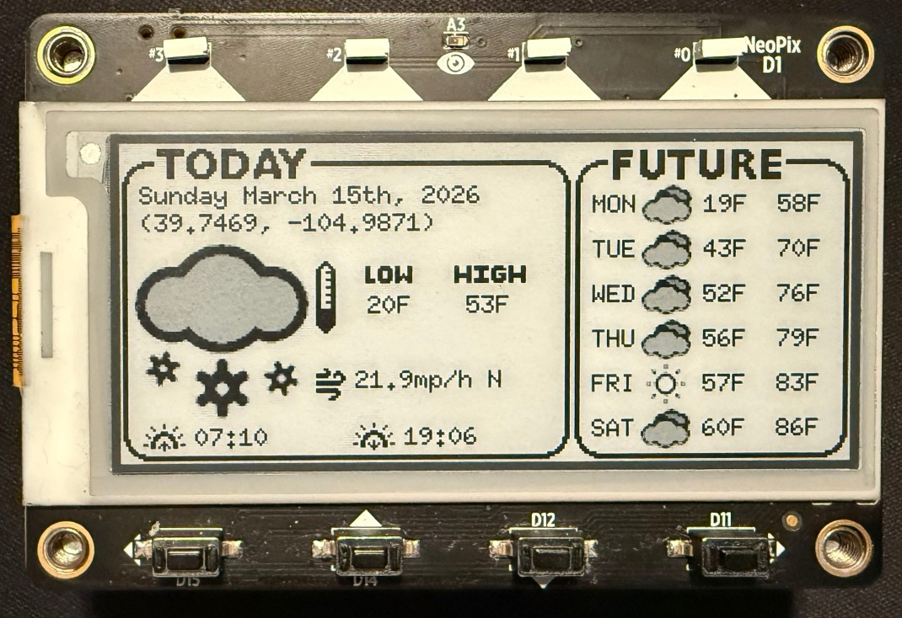

# MagTag Weather Station



A `no_std` Rust firmware for the [Adafruit MagTag](https://www.adafruit.com/product/4800) (ESP32-S2). It displays weather information on the e-paper display. Supports both the 2025 edition (SSD1680 controller) and the original MagTag (IL0373 controller) via Cargo feature flags. Built with the `esp-hal` ecosystem for ESP32-S2, this project demonstrates async/await patterns with Embassy, network connectivity with `esp-radio`, and e-paper graphics rendering.

## Features

- **E-Paper Display**: Drives a 2.9" grayscale e-paper display (296x128 pixels) over SPI, supporting SSD1680 (2025 edition) and IL0373 (original) controllers via feature flags
- **WiFi Connectivity**: Connects to WiFi using `esp-radio` and `embassy-net` with async networking
- **Weather Data**: Fetches weather forecasts from the [Open-Meteo API](https://open-meteo.com/)
- **Graphical UI**: Renders weather data with icons, text, and formatting using `embedded-graphics` and `embedded-text`
- **Low Power**: Enters deep sleep between updates to conserve battery (24-hour update cycle by default)
- **Error Handling**: Displays error messages on the e-paper screen when issues occur
- **No Standard Library**: Runs entirely in `no_std` environment with custom allocator

## Credits

This project was inspired by Adafruit's [MagTag Weather Example](https://learn.adafruit.com/magtag-weather) [(github)](https://github.com/adafruit/Adafruit_Learning_System_Guides/blob/main/MagTag/MagTag_Weather/openmeteo/code.py) and demonstrates how to build similar functionality in pure Rust with `no_std`. The background and icon asserts are modified from the originals.

## Hardware Requirements

- [Adafruit MagTag](https://www.adafruit.com/product/4800) (ESP32-S2 based e-paper display board), either:
  - **2025 Edition** with SSD1680 controller (default)
  - **Original edition** with IL0373 controller (use `--features display-il0373`)
- USB cable for programming and power
- Optional: USB-to-serial adapter for debugging (see Serial Logging section)

## Software Prerequisites

1. **Rust Toolchain**: Install Rust with the Espressif Xtensa toolchain
   - Follow the [Espressif Getting Started guide](https://docs.espressif.com/projects/rust/book/getting-started/toolchain.html)
   - Requires the `xtensa-esp32s2-none-elf` target

2. **Flashing Tool**: Install `espflash`
   ```bash
   cargo install espflash
   ```

3. **Environment Variables**: Set WiFi credentials as environment variables
   ```bash
   export WIFI_SSID="YourNetworkName"
   export WIFI_PASSWORD="YourNetworkPassword"
   ```

## Configuration

Edit [src/config.rs](src/config.rs) to customize:

- `OPENMETEO_LATITUDE` / `OPENMETEO_LONGITUDE`: Decimal coordinates used for forecast (e.g., `"35.0"` / `"-100.0"`)
- `OPENMETEO_TIMEZONE`: IANA timezone name for your location (e.g., `"America/Denver"`)
- `OPENMETEO_TEMP_UNIT`: `"fahrenheit"` or `"celsius"`
- `OPENMETEO_WIND_UNIT`: `"mph"` or `"kmh"`

WiFi credentials are read from environment variables at compile time:
- `$WIFI_SSID`: The name of your WiFi network
- `$WIFI_PASSWORD`: The passphrase for your WiFi network

## Building

Select your target hardware using Cargo feature flags. The default is `display-ssd1680` (2025 edition MagTag). Exactly one display feature must be enabled; enabling both or neither is a compile error. 

```bash
# 2025 edition MagTag (SSD1680, default)
cargo build --release

# Original MagTag (IL0373)
cargo build --release --no-default-features --features display-il0373
```

## Flashing

The project is configured to use `espflash` as the default runner:

```bash
# Build and flash in one command (SSD1680, default)
cargo run --release

# Build and flash for original MagTag (IL0373)
cargo run --release --no-default-features --features display-il0373

# Or flash a pre-built binary
espflash flash --monitor --chip esp32s2 target/xtensa-esp32s2-none-elf/release/magtag_weatherstation
```

## Runtime Behavior

1. **Startup**: Initializes peripherals, display, and WiFi
2. **Network**: Connects to WiFi and obtains IP via DHCP
3. **Fetch**: Retrieves weather data from Open-Meteo API
4. **Display**: Renders weather information on e-paper screen
5. **Sleep**: Enters deep sleep for 24 hours (or 5 minutes on error)
6. **Repeat**: Wakes up and repeats the cycle

## Serial Logging

The firmware outputs log messages via UART at 115200 baud using the `log` facade and `esp-println`.

**Important**: The `esp-println` crate does not support using the MagTag's USB interface for serial output. To view logs, you must:

1. Connect a USB-to-serial adapter to the RX/TX pins on the back of the MagTag
2. Open a serial terminal at 115200 baud
3. Logs are controlled by the `ESP_LOG` environment variable (set in `.cargo/config.toml`)

## Dependencies

Key dependencies include:

- **epd-datafuri**: E-paper display driver (supports SSD1680 and IL0373 controllers)
- **esp-hal** (1.0.0): Hardware abstraction layer for ESP32-S2
- **esp-rtos**: RTOS integration with Embassy executor
- **esp-radio**: WiFi radio driver
- **embassy-net**: Async TCP/IP networking stack
- **embassy-executor**: Async task executor
- **embedded-graphics**: 2D graphics library
- **embedded-text**: Text rendering for embedded systems
- **serde** / **serde-json-core**: JSON parsing in `no_std`
- **heapless**: Stack-allocated collections

## Troubleshooting

### Build Errors

- Ensure `WIFI_SSID` and `WIFI_PASSWORD` environment variables are set
- Verify Xtensa Rust toolchain is installed: `rustup target list | grep xtensa`
- Check that `espflash` is in your PATH: `espflash --version`

### Network Issues

- Verify WiFi credentials in environment variables
- Monitor serial output to see connection status
- Look for error messages on the display itself

### Display Issues
- Verify you are using the correct feature flag for your hardware revision (`display-ssd1680` for 2025 edition, `display-il0373` for the original)

## Contributing

Contributions are welcome! Please:

- Keep changes focused on specific features or fixes
- Maintain `no_std` compatibility
- Test on actual MagTag hardware when possible
- Follow existing code style and patterns

## License

MIT
